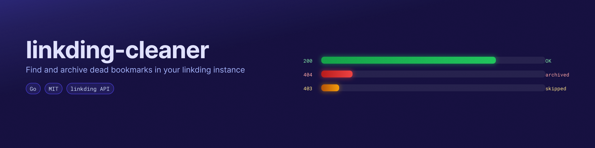

# linkding-cleaner



A CLI tool that checks all your [linkding](https://github.com/sissbruecker/linkding) bookmarks
for broken URLs and archives any that return 404.

## Usage

```sh
linkding-cleaner --url https://links.example.com
```

Required:

| Flag / Env var | Description |
|----------------|-------------|
| `--url` | Base URL of your linkding instance |
| `--token` or `LINKDING_TOKEN` | Your linkding API token |

Optional:

| Flag | Default | Description |
|------|---------|-------------|
| `--concurrency` | `10` | Number of parallel URL checks |
| `--timeout` | `10s` | Per-request timeout |
| `--dry-run` | | Check URLs and report what would be archived without making changes |
| `--version` | | Print version and exit |

## Examples

Using an environment variable for the token:

```sh
export LINKDING_TOKEN=your-token-here
linkding-cleaner --url https://links.example.com
```

Passing the token inline (useful in scripts):

```sh
linkding-cleaner --url https://links.example.com --token your-token-here
```

Tune concurrency and timeout for slower connections:

```sh
linkding-cleaner --url https://links.example.com --concurrency 5 --timeout 30s
```

## Install

**Homebrew (macOS):**

```sh
brew install dakotahp/tap/linkding-cleaner
```

**Go install:**

```sh
go install github.com/dakotahp/linkding-cleaner/cmd/linkding-cleaner@latest
```

**Download a binary** from the [releases page](https://github.com/dakotahp/linkding-cleaner/releases).

**Build from source:**

```sh
git clone https://github.com/dakotahp/linkding-cleaner
cd linkding-cleaner
go build ./cmd/linkding-cleaner
```

## Releasing

Releases are automated via [GoReleaser](https://goreleaser.com) and GitHub Actions. Pushing a `v*` tag triggers the release workflow, which:

- Builds binaries for Linux, macOS, and Windows (amd64 + arm64)
- Creates a GitHub Release with a changelog and `checksums.txt`
- Updates the [Homebrew tap](https://github.com/dakotahp/homebrew-tap) formula

**To cut a release:**

```sh
git tag v1.2.3
git push origin v1.2.3
```

The workflow requires two repository secrets:
- `GITHUB_TOKEN` — provided automatically by GitHub Actions
- `HOMEBREW_TAP_GITHUB_TOKEN` — a personal access token with write access to the `homebrew-tap` repo

## Output

- Red `[404]` — broken link, automatically archived in linkding
- Yellow `[403]` — forbidden (not archived)
- Plain `[200]` — healthy
- `[ERR]` — network error or timeout (skipped)

When run interactively, an animated progress bar and live elapsed time are shown during checking. Total elapsed time is always printed at the end.
